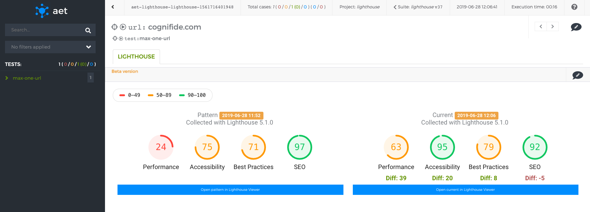

# Local AET instance with docker swarm
This directory contains configuration that enables setting up local AET instance using single-node swarm cluster. 
Note that this is *not production recommended setup*.

AET stack defined in this example runs:
- MongoDB container with mounted volume (for persistency)
- Selenium Grid with Hub and 3 Nodes (2 Chrome instances each, totally 6 browsers)
- AET ActiveMq container
- AET Browsermob container
- AET Apache Karaf container with AET core installed (Runner, Workers, Web-API, Datastorage, Executor)
- AET Apache Server container with AET Report and [AET suite generator](https://github.com/m-suchorski/suite-generator/tree/feature/suite)

## Lighthouse special edition



### How to run
0. Make sure you meet all [prerequisites](https://github.com/Skejven/aet-docker#prerequisites).
1. Provide working Lighthouse
  a) Recommended way is to use instructions from the [AET Lighthouse plugin](ToDo)
  b) Use [AET Lighthouse Docker image]() and run a container.
2. Download and unzip [aet-lighthouse-edition](https://bintray.com/skejven/AET/download_file?file_path=lighthouse-aet-swarm.zip).
3. Configure `lighthouseInstanceUri` property in the `configs/com.github.skejven.collector.LighthouseCollectorFactory.cfg`.
4. Run `docker stack deploy -c aet-swarm.yml aet` to run AET Stack with Lighthouse plugin.

### Example usage
To use the `lighthouse` plugin simply put `<lighthouse />` tag in `collect` and `compare` sections.

Example suite:

```xml
<?xml version="1.0" encoding="UTF-8" ?>
<suite name="lighthouse" company="aet" project="lighthouse">
    <test name="max-one-url">
        <collect>
            <lighthouse/>
        </collect>
        <compare>
            <lighthouse/>
        </compare>
        <urls>
            <url href="https://github.com"/>
        </urls>
    </test>
</suite>

```

> Yes, you don't need `<open/>`.

### Configuring Lighthouse instance for AET
Using `lighthouse` AET plugin requires configuring `lighthouseInstanceUri` property in the 
`configs/com.github.skejven.collector.LighthouseCollectorFactory.cfg`.
